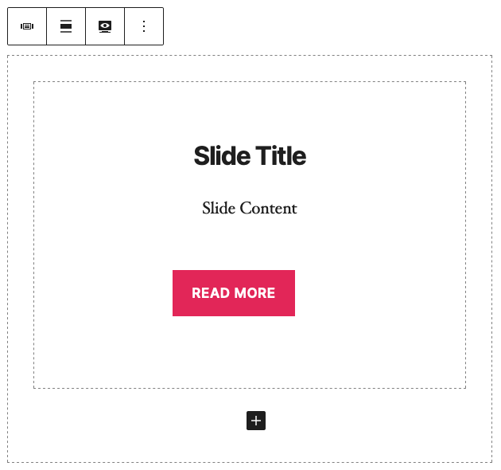
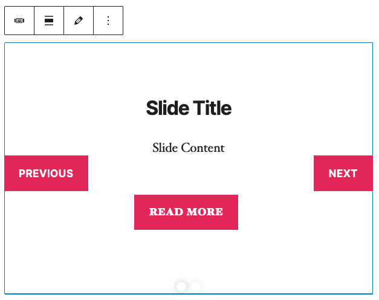

# `Carousel` #

A block that contains one or more `Slide` blocks and displays a carousel slider with navigation buttons and pagination dots.

## Attributes ##

### `showPreview: Boolean` ###
*Default: `true`.* Tracks whether `preview` or `edit` mode is being displayed in the admin editor.

### `slideCount: Number` ###
*Default: `0`.* Tracks number of `Slide` blocks contained in the `Carousel` block.

## Usage ##
*Category: WDS Blocks*

Add `Carousel` block then add any number of `Slide` blocks within. For each `Slide` block, add content and configure settings.

## Toolbar Buttons ##

### Alignment ###
*Default: `wide`.* Switch between `wide` (width of post content ) and `full` (width of full page).

### Mode ###
*Default: `preview`.* Switch between `preview` (fully-functional carousel) and `edit` (standard block editor). Can also be toggled from `preview` to `edit` mode by double-clicking on the block.

## Screenshots ##

### Editor: Edit Mode ###

### Editor: Preview Mode ###

